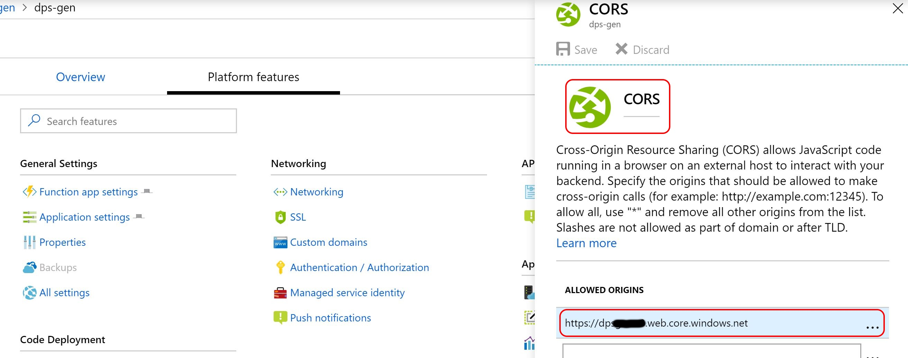

# Turn a Command Line tool into a REST API with Azure Functions

|Author|[Dave Glover](https://developer.microsoft.com/en-us/advocates/dave-glover), Microsoft Cloud Developer Advocate |
|----|---|
|Documentation|[README](https://gloveboxes.github.io/Turn-a-Command-Line-tool-into-a-REST-API-with-Azure-Functions/) |
|Platform| [Azure Functions](https://docs.microsoft.com/en-us/azure/azure-functions/?WT.mc_id=twitter-article-dglover)|
|Documentation | [Create Azure HTTP triggered Functions](https://docs.microsoft.com/en-us/azure/azure-functions/functions-create-first-azure-function/?WT.mc_id=twitter-article-dglover), [Azure IoT Central](https://docs.microsoft.com/en-us/azure/iot-central/?WT.mc_id=medium-article-dglover), [Azure Device Provisioning Service](https://docs.microsoft.com/azure/iot-dps/about-iot-dps/?WT.mc_id=twitter-article-dglover), [Connection String Generator (dps_str)](https://github.com/Azure/dps-keygen) |
|Date|As at Nov 2018|

## Introduction

Thought I'd share a neat trick to convert a command line tool into a REST API using Azure HTTP Functions.

At a high level, you create an Azure HTTP Function, upload the command line tool, add code to pass in command line arguments, redirect standard output, start the command process, and return the standard output from the command line in the HTTP response.

I'm running an [Azure IoT Central](https://azure.microsoft.com/en-au/services/iot-central/) workshop and minimize setup I wanted the workshop to be completely browser-based. Azure IoT Central uses the [Azure Device Provisioning Service](https://docs.microsoft.com/azure/iot-dps/about-iot-dps/?WT.mc_id=twitter-article-dglover) and you need to use the [Connection String Generator (dps_str)](https://github.com/Azure/dps-keygen) command line tool to create a real device connection string.

## How to run a command line tool to a REST API

1. Create an [Azure HTTP triggered Function](https://docs.microsoft.com/en-us/azure/azure-functions/functions-create-first-azure-function/?WT.mc_id=twitter-article-dglover) from the Azure Portal
2. Upload the command and associated libraries.
   
3. This is the code I used to pass in command line arguments, redirect standard output, and start the command. You'll obviously need to tweak for the command you want to run.

    ```c#
    #r "Newtonsoft.Json"
    
    using System.Net;
    using Microsoft.AspNetCore.Mvc;
    using Microsoft.Extensions.Primitives;
    using Newtonsoft.Json;
    using System;
    using System.Diagnostics;
    
    public static async Task<IActionResult> Run(HttpRequest req, ILogger log)
    {
        string result;
        string functionName = "ConnectionString";
    
        string scope = req.Query["scope"];
        string deviceid = req.Query["deviceid"];
        string key = req.Query["key"];
    
        string requestBody = await new StreamReader(req.Body).ReadToEndAsync();
        dynamic data = JsonConvert.DeserializeObject(requestBody);
        scope = scope ?? data?.scope;
        deviceid = deviceid ?? data?.deviceid;
        key = key ?? data?.key;
    
        if (String.IsNullOrEmpty(scope) ||
            String.IsNullOrEmpty(deviceid) ||
            String.IsNullOrEmpty(key) )
        {
            return new BadRequestObjectResult("Please pass a IoT Central device Scope, DeviceId and key (url encoded) on the query string or in the request body");
        }
    
        var workingDirectory = Path.Combine(@"d:\home\site\wwwroot", functionName);
        Directory.SetCurrentDirectory(workingDirectory);
        
        string arguments = $"\"{scope}\" \"{deviceid}\" \"{key}\"";
        
        ProcessStartInfo start = new ProcessStartInfo();
        start.FileName = @"dps_cstr.exe"; 
        start.UseShellExecute = false;
        start.RedirectStandardOutput = true;
        start.Arguments = arguments;
    
        using (Process process = Process.Start(start))
        {
            using (StreamReader reader = process.StandardOutput)
            {
                result = reader.ReadToEnd();
            }
        }
    
        return result != null
            ? (ActionResult)new OkObjectResult($"{result}")
            : new BadRequestObjectResult("Please pass a IoT Central device Scope, DeviceId and key (url encoded) on the query string or in the request body");
    }    
    ```
4. Done!

## Browser UI for the REST API

I wanted a web browser UI for the REST API so I wrote a simple HTML/JavaScript [App](dps-cstr.html) and I call the REST API from JavaScript. Given no server-side processing is required the HTML page is hosted using [Static website hosting in Azure Storage](https://docs.microsoft.com/en-us/azure/storage/blobs/storage-blob-static-website/?WT.mc_id=twitter-article-dglover).

### CORS Rules

As you are calling the Azure HTTP Function REST API from Javascript you will need to adjust the CORS rules for the Azure HTTP Function.

From the Azure Function you created

1. From the Function App UI select Platform features
    
2. Specify the origin URL of the JavaScript app making the cross-origin calls.
    

## Acknowledgements

1. How to [Run Console Apps on Azure Functions](https://azure.microsoft.com/en-au/resources/samples/functions-dotnet-migrating-console-apps/)
2. How to [Run .exe executable file in Azure Function](https://stackoverflow.com/questions/45348498/run-exe-executable-file-in-azure-function)